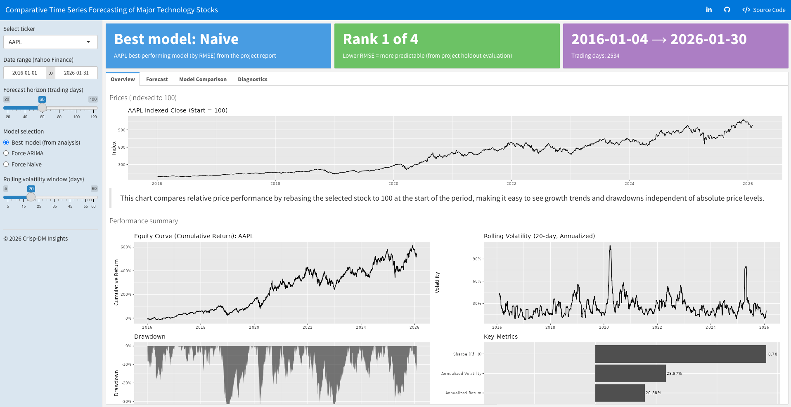

# Comparative Time Series Forecasting of Major Technology Stocks

## Business Overview
This project presents a comparative time series forecasting analysis of four major U.S. technology stocks: **Apple (AAPL), Microsoft (MSFT), Tesla (TSLA), and Amazon (AMZN)**. Using nearly a decade of daily market data sourced from Yahoo Finance (**January 2016 – January 2026**), the analysis investigates how differences in trend behavior, volatility regimes, and market dynamics influence **short-term forecastability**.

The project is structured end-to-end using the **CRISP-DM methodology**, emphasizing reproducibility, principled evaluation, and stakeholder-relevant insights. Rather than optimizing a single forecast, the primary objective is to **compare predictability across assets under a consistent modeling framework**.

## Problem Statement
Historical stock prices of major technology companies exhibit distinct trends, volatility patterns, and market dynamics. Understanding these behaviors is essential for forecasting short-term price movements and assessing financial risk.

The objective of this project is to perform a comparative time series analysis of Apple, Microsoft, Tesla, and Amazon using daily adjusted closing prices. The analysis aims to identify trends, seasonality, and volatility characteristics across each stock and to evaluate forecasting models in terms of accuracy, robustness, and reliability. Model performance is assessed to determine **which stocks are more predictable and which exhibit higher uncertainty** over short forecasting horizons.

## Exploratory Data Analysis & Key Trends
Exploratory analysis revealed strong long-term upward trends across all four stocks, confirming **non-stationarity in price levels**. Because absolute price scales differ substantially, prices were normalized by indexing each series to a common baseline (**start = 100**) to enable meaningful relative performance comparisons. This transformation revealed substantial divergence in cumulative growth trajectories, particularly for Tesla.

Daily **log returns** were analyzed to assess risk and volatility behavior. Return distributions displayed heavy tails and clear **volatility clustering**, consistent with stylized facts of financial time series. Rolling 20-day volatility measures showed that **Tesla experienced the highest and most frequent volatility spikes**, while Apple and Amazon exhibited comparatively more stable dynamics. Monthly time-series decomposition further indicated that **trend components dominate**, with weak and unstable seasonal effects across all assets.

## Models Explored and Results
Two benchmark forecasting approaches were evaluated for each stock using a fixed **60-day holdout window**:

- **Naive (Random Walk) Model** – A strong financial baseline where the last observed value persists.
- **ARIMA (auto.arima)** – A classical statistical time-series model capturing short-term autocorrelation and drift.

Model performance was assessed using **RMSE, MAE, and MAPE**. Results demonstrate that forecast effectiveness is **asset-specific**:

- The naive baseline outperformed or matched ARIMA for **all four stocks**
- ARIMA did not consistently improve accuracy in highly volatile or near-random-walk series
- Tesla exhibited the lowest short-horizon predictability due to frequent volatility regime shifts

These findings reinforce a key financial insight: **greater model complexity does not guarantee improved forecast accuracy**, particularly for short-term price-level forecasting.

## Dashboard Preview

An interactive **Shiny Flexdashboard** accompanies this analysis to support exploratory comparison and stakeholder-friendly interpretation. The dashboard includes:

- **Indexed price trajectories** for relative performance comparison  
- **Daily return and drawdown summaries** to highlight risk characteristics  
- **Rolling volatility visualizations** to compare uncertainty regimes  
- **Forecast-vs-actual plots** for each stock  
- **Model accuracy leaderboards** ranking assets by forecastability  

The dashboard enables users to visually assess how trend stability and volatility impact short-term predictability across assets.

## Reflections & Lessons Learned
This analysis highlights that **forecastability varies substantially even among similar large-cap technology stocks**. Assets with smoother volatility regimes tend to be more predictable under classical time-series models, while highly volatile stocks limit the gains achievable beyond naive baselines.

Key takeaways include:
- The importance of **strong baselines** in financial forecasting  
- The necessity of **asset-specific model evaluation**  
- The value of **residual diagnostics** to validate modeling assumptions  
- The benefits of comparative analysis under a consistent framework  

Future enhancements could incorporate alternative model families (e.g., state-space or machine-learning models), exogenous predictors, longer forecast horizons, and automated deployment pipelines.

