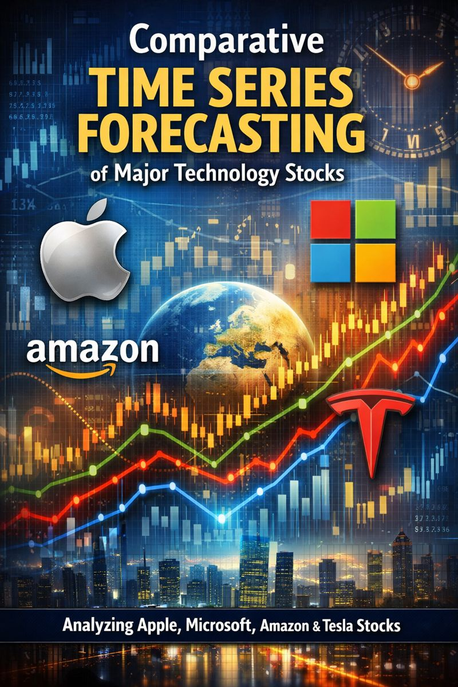

# Comparative Time Series Forecasting of Major Technology Stocks

Historical stock prices of major technology companies exhibit distinct trends, volatility patterns, and market dynamics. Understanding these behaviors is essential for forecasting price movements and assessing financial risk.

The objective of this project is to perform a comparative time series analysis of Apple, Microsoft, Tesla, and Amazon stock prices using historical market data. The project aims to identify trends, seasonality, and volatility across each stock and develop forecasting models to predict short-term price movements. Model performance will be evaluated to assess forecasting accuracy and differences in predictability across companies.
